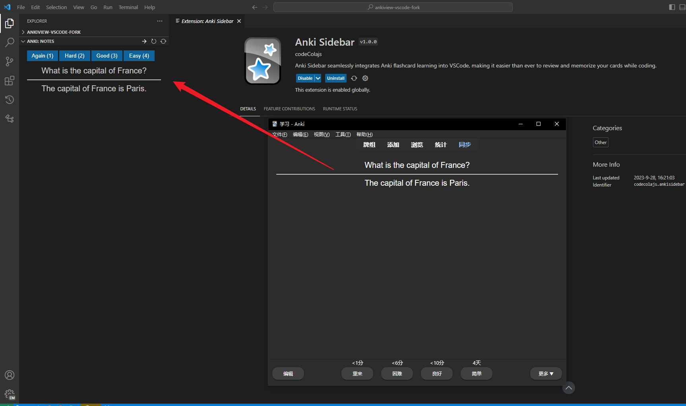

# Anki Sidebar

- [English](./README.md)

## 简介

Anki 背诵助手是一个为 [Anki](https://apps.ankiweb.net/) 用户设计的 VSCode 插件，它旨在帮助你更轻松地背诵 Anki 卡片。通过与 Anki 数据库的集成，该插件使你可以在 VSCode 中背诵卡片，以提高学习效率。

**灵感来源**: 该插件的灵感来自于 [Anki View](https://github.com/feilongfl/ankiview-vscode) 插件，感谢 Anki View 的开发者

## 示例

## 依赖项

为了正常使用 Anki 背诵助手插件，你需要安装以下两个依赖项：

1. **Anki**: 请确保你已经安装了 [Anki](https://apps.ankiweb.net/) 软件，并且它正常运行。

2. **AnkiConnect 插件**: 为了与 Anki 软件进行通信，你需要安装 [AnkiConnect 插件](https://ankiweb.net/shared/info/2055492159) 到你的 Anki 软件中。请按照 AnkiConnect 插件的安装说明来配置它

## 授权

项目遵循 [Apache License 2.0](LICENSE) 许可。

